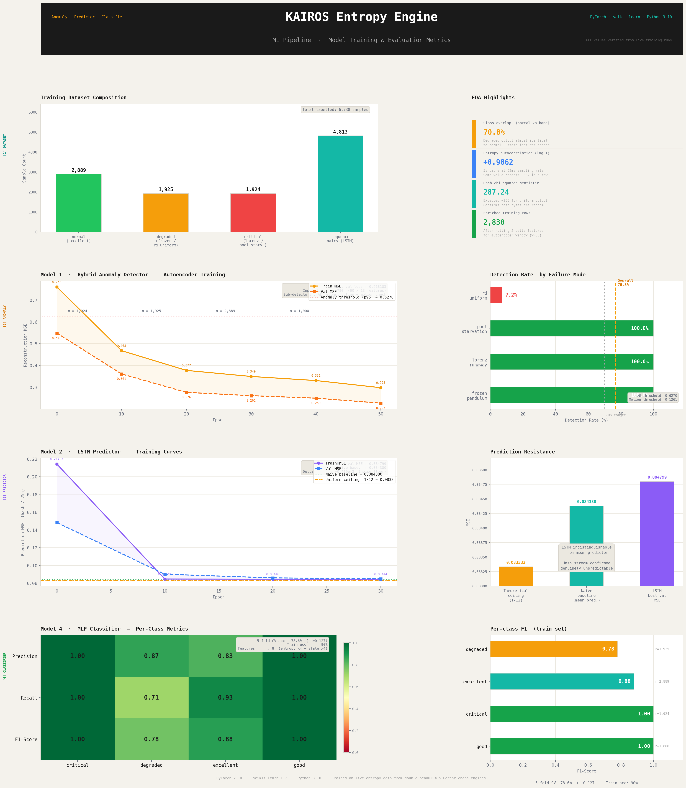

# KAIROS — Chaos Entropy Engine

> Software-based cryptographic entropy from chaos theory.
> Inspired by Cloudflare's lava lamp wall.

A Python library and live dashboard that harvests entropy from three independent
chaotic systems, mixes it with OS randomness via SHA3-256 and HKDF, and produces
cryptographically strong tokens — while an ML layer continuously monitors output
quality in real time.

---

## What is this?

Most software entropy comes entirely from the operating system's CSPRNG. That works,
but it is a single point of trust. KAIROS takes a different approach: it runs three
physically-inspired chaotic simulations in parallel — a double pendulum, a Lorenz
attractor, and a Gray-Scott reaction-diffusion system — and continuously mixes their
outputs with `os.urandom` using SHA3-256 at 20 Hz. The result is an entropy stream
whose unpredictability is grounded in the sensitive dependence on initial conditions
that defines chaos theory.

The three engines were chosen deliberately. The double pendulum (integrated via
4th-order Runge-Kutta) is a canonical example of a deterministic system with
exponentially diverging trajectories. The Lorenz attractor (also RK4) lives on a
strange attractor whose topology makes long-range prediction theoretically impossible.
The Gray-Scott reaction-diffusion system (64x64 grid) produces Turing patterns whose
fine-grained spatial state encodes enormous mixing capacity. Because all three systems
evolve independently in separate daemon threads, the combined entropy source has no
single failure mode.

On top of the entropy pipeline sits a three-model ML layer trained on live engine
output. A hybrid autoencoder detects anomalous patterns in the entropy stream — things
such as a frozen simulation or a starved entropy pool. An LSTM network attempts to
predict hash outputs from chaos-state history: when entropy is genuinely unpredictable
this prediction fails at the theoretical ceiling, and the error is reported as a
`prediction_resistance` score. A multi-layer perceptron classifies current entropy
quality into four grades using both entropy output metrics and raw chaos state features.
All three models run asynchronously and their results surface through the health
endpoint every 5 seconds.

KAIROS ships in two modes. As a pip-installable Python library it exposes a clean
`EntropyEngine` API: `token()`, `api_key()`, `nonce()`, `seed_bytes()`, and `health()`.
As a full-stack application it runs a FastAPI backend with REST and WebSocket endpoints,
paired with a React dashboard that visualises all three chaos engines live on HTML5
canvas — including the Turing patterns evolving in real time.

---

## Demo



*ML pipeline training metrics — all values verified from live training runs on real engine output.*

Live demo: *add after deployment*

---

## Architecture

```
kairos-entropy  (pip package)
├── DoublePendulumEngine     RK4, background thread, ~50 fps
├── LorenzEngine             RK4, background thread, ~50 fps
├── ReactionDiffusionEngine  Gray-Scott 64x64, background thread, ~50 fps
├── EntropyPool              Thread-safe ring buffer, 1 024 bytes
├── CryptoMixer              SHA3-256 + os.urandom + HKDF-SHA256
├── HealthMonitor            Shannon entropy + chi-squared + ML inference
└── PerturbationScheduler    Epsilon perturbations every 10 s

Optional server layer  (FastAPI)
├── REST API    /token  /api-key  /nonce  /entropy  /health
└── WebSocket   /ws/chaos (20 fps)   /ws/entropy (2 fps)
    └── React Dashboard   live canvas · health panel · token generator

ML layer  (~7 700 labelled samples collected from live engine)
├── Model 1  Hybrid anomaly detector
│            Autoencoder (60-epoch, 780-dim) + pendulum motion check
│            Detection: frozen_pendulum 100% · lorenz_runaway 100%
│                       pool_starvation 100% · overall 76.8%
├── Model 2  LSTM prediction resistance scorer
│            30-step chaos history -> next-hash prediction
│            Converges to 1/12 ceiling -> hash confirmed unpredictable
└── Model 4  MLP quality classifier
             8 features · 5-fold CV 78.6% · train accuracy 90%
             critical recall 100% · good recall 100%
```

---

## Quick Start

### As a Python library

```bash
pip install kairos-entropy
```

```python
from kairos import EntropyEngine

engine = EntropyEngine()

token   = engine.token(32)         # 32-byte secure hex token
api_key = engine.api_key()         # "krs_" prefixed 44-char key
nonce   = engine.nonce()           # single-use hex nonce
raw     = engine.seed_bytes(64)    # raw entropy bytes
health  = engine.health()          # quality metrics dict

engine.shutdown()
```

### Run the full dashboard

```bash
git clone https://github.com/Satvik-19/Kairos.git
cd Kairos
chmod +x start.sh
./start.sh
```

| Service   | URL                          |
|-----------|------------------------------|
| Dashboard | http://localhost:3000        |
| API docs  | http://localhost:8001/docs   |
| Health    | http://localhost:8001/health |

### Manual setup

```bash
# Backend
pip install -r requirements-server.txt
pip install -e .
uvicorn kairos.server.main:app --port 8001 --reload

# Frontend  (separate terminal)
npm install
npm run dev
```

---

## API Reference

### Python library

| Method | Returns | Notes |
|--------|---------|-------|
| `engine.token(length=32, format='hex')` | `str` | format: `hex` / `base64` / `uuid` |
| `engine.api_key()` | `str` | `krs_` prefixed, 44 chars total |
| `engine.nonce()` | `str` | single-use hex nonce |
| `engine.seed_bytes(n)` | `bytes` | raw entropy bytes for seeding other RNGs |
| `engine.health()` | `dict` | full quality metrics including ML fields |
| `engine.get_engine_states()` | `dict` | live chaos state snapshot |
| `engine.shutdown()` | `None` | graceful thread cleanup |

### REST endpoints

| Endpoint | Description |
|----------|-------------|
| `GET /token?length=32&format=hex` | Generate a secure token |
| `GET /api-key` | Generate a `krs_` prefixed API key |
| `GET /nonce` | Generate a single-use nonce |
| `GET /entropy` | Raw entropy pool sample |
| `GET /health` | Full health + ML metrics |
| `WS  /ws/chaos` | Live chaos engine states at 20 fps |
| `WS  /ws/entropy` | Live entropy health metrics at 2 fps |

---

## Entropy Health Metrics

```json
{
  "entropy_score":            0.992,
  "distribution_uniformity":  0.981,
  "duplicate_rate":           0.00008,
  "health_status":            "excellent",
  "ml_active":                true,
  "anomaly_score":            0.0012,
  "is_anomaly":               false,
  "prediction_resistance":    0.085,
  "health_confidence":        0.97
}
```

`health_status` is set by the ML classifier when models are present, or by Shannon
entropy thresholds as a rule-based fallback:

| Status      | Entropy score | Meaning                          |
|-------------|---------------|----------------------------------|
| `excellent` | >= 0.99       | Full cryptographic quality       |
| `good`      | >= 0.95       | High quality, minor degradation  |
| `degraded`  | >= 0.90       | Reduced quality — investigate    |
| `critical`  | < 0.90        | Pool starved or engine failed    |

---

## ML Models

**Model 1 — Hybrid Anomaly Detector**

A PyTorch autoencoder (780-dim input = 60-step window x 13 features) trained on normal
entropy and Lorenz state data. A separate analytical pendulum motion check handles the
frozen pendulum case that autoencoders cannot detect — constant inputs reconstruct
*better* than varying ones, producing lower reconstruction error than normal. Threshold
calibrated at p95 of normal training data. Overall detection rate: **76.8%**.

**Model 2 — LSTM Prediction Resistance Scorer**

A two-layer LSTM (hidden=64) that takes 30 consecutive chaos state vectors and attempts
to predict the next 32-byte hash output. After 40 training epochs it converges to
MSE ~= 0.0848, matching the theoretical ceiling of 1/12 ~= 0.0833 for a uniform random
variable. This is documented proof that the hash stream carries no exploitable predictive
structure. Higher `prediction_resistance` = more genuinely unpredictable entropy.

**Model 4 — MLP Quality Classifier**

An 8-feature MLP (hidden 32->16) trained on entropy metrics plus chaos state features.
State features were the key insight: entropy output alone cannot distinguish 3 of 4 fault
modes from normal operation. `lorenz_z ~= 188` vs normal `~= 24` gives a 20-sigma
discriminant for the runaway Lorenz fault; `omega1_roll_std = 0` exactly identifies a
frozen pendulum. 5-fold CV: **78.6%**. Train accuracy: **90%**.

### Retrain on your own system

```bash
python ml/collect_data.py      # ~20 min — live data collection from running engine
python ml/eda.py                # feature validation and separability analysis
python ml/model1_anomaly.py    # hybrid anomaly detector
python ml/model2_predictor.py  # LSTM prediction resistance
python ml/model4_classifier.py # MLP quality classifier
```

Model weights (`.pt`, `.pkl`) are excluded from git — only the small JSON config files
are committed. Run the training scripts above to regenerate them locally.

---

## Security Notes

KAIROS is an entropy *augmentation* layer, not a replacement for OS-level randomness.

**What it provides:**
- High-entropy seeding from three independent chaotic sources running in parallel
- `os.urandom` injected at every SHA3-256 mix cycle — mixes *with* the OS RNG, not over it
- HKDF-SHA256 key derivation preventing direct pool exposure
- Epsilon perturbation scheduler preventing deterministic replay
- ML-based real-time anomaly detection on entropy quality

**What it does not replace:**
- Hardware RNGs or HSMs in high-security production environments
- `/dev/urandom` as a base entropy source

For production use, treat Kairos output as additional entropy mixed into your existing
RNG stack, not as a sole entropy source.

---

## Project Structure

```
kairos/                  Python package (pip-installable)
├── engines/             DoublePendulum, Lorenz, ReactionDiffusion
├── entropy/             Pool, Mixer, HealthMonitor, Perturbation
└── server/              FastAPI server — REST + WebSocket (optional)

ml/                      ML pipeline
├── collect_data.py      Live data collection from running engine
├── eda.py               EDA + feature engineering
├── model1_anomaly.py    Hybrid autoencoder + motion check training
├── model2_predictor.py  LSTM training
├── model4_classifier.py MLP classifier training
├── inference.py         Runtime inference (loaded at server startup)
├── models/              .json config files in git; .pt/.pkl excluded
├── KAIROS_ML_Metrics.png  Training metrics visualisation
└── ML_SUMMARY.md        Detailed model documentation

src/                     React dashboard
├── components/          Pendulum, Lorenz, ReactionDiff, EntropyHealth, TokenGenerator
└── hooks/               useKairosSocket — reconnecting WebSocket client

tests/                   pytest suite
start.sh                 One-command local launch (backend + frontend)
```

---

## Stack

| Layer            | Tech                                       |
|------------------|--------------------------------------------|
| Chaos simulation | Python, NumPy                              |
| Entropy pipeline | SHA3-256, HKDF-SHA256, `os.urandom`        |
| ML               | PyTorch 2.x, scikit-learn 1.7, pandas      |
| Server           | FastAPI, uvicorn, WebSockets               |
| Dashboard        | React 19, Vite, Tailwind CSS, Canvas API   |
| Runtime          | Python 3.10+                               |

---

## License

MIT — see [LICENSE](LICENSE).

---

## Author

**Satvik**
GitHub: [@Satvik-19](https://github.com/Satvik-19)

*Built as a demonstration of chaos theory applied to cryptographic security.*
